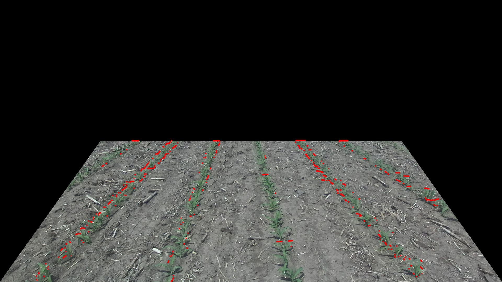
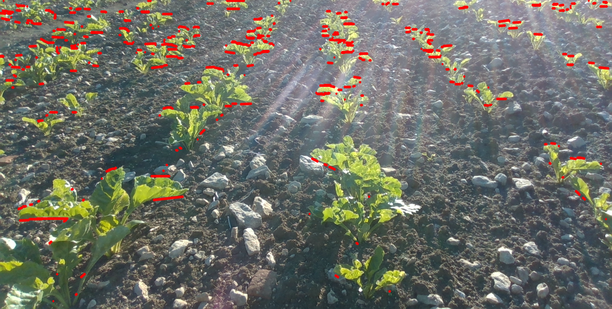
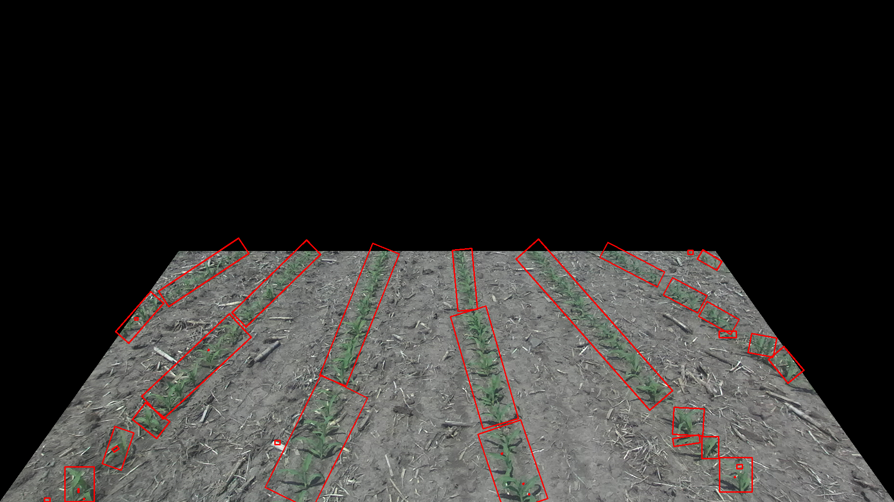
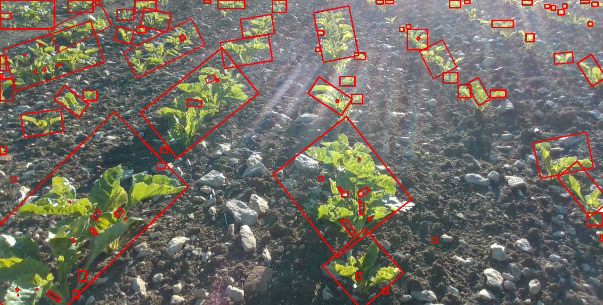

# Crop lane visual servoing
Crop lane visual servoing algorithm - Development Report

The following outlines the progress and challenges encountered during the development of the visual servoing algorithm. The primary objective taken into consideration is ability to be able to detect lanes robustly in crop fields. The focus has been on identifying and implementing various image processing techniques that can reliably detect and follow crops under certain degree of variaitons.

## Implementation Pipeline:
1. Crop Segmentation
    1. Preprocess image ✔️
    2. Segment green colour to detect crops ✔️ 
    3. Denoise mask ✔️
    4. Find contours ✔️
    5. Find centers ✔️
2. Median Lane Detection
    1. shape fitting
        1. Line fitting ❌
        2. Hough transforms ❌
        3. Box fitting ✔️
        4. Centeroid based techniques ⚠️
        5. Sliding window ⚠️ (needs tuning)
    2. Individual crop row detection
        1. Moving variance signal method ⚠️ (needs tuning) (courtesy - "Towards Autonomous Visual Navigation in Arable Fields" by Ahmadi et al.)
        2. Box Chaining method ⚠️ - Todo
3. Error calculation
    1. Calculated from the median lane vector ✔️

Possible directions that could habe been taken:
- Deep Learning based segmentation methods
- Feature point matching type methods

## Experiments

### Experiment 1 - Line fitting
Image preprocessing


### Experiment 2 - Line fitting
Line fitting through hough transforms:





### Experiment 3 - Box Fitting 




The box fitting results seem promising therefore the development of box chaining method, where I chain boxes in close proximity from top to bottom until the end of the image in order to segment out rows.


### Experiment 4 - Centroid 


## Results


## Repository Installation and Usage

1. Clone the repository:

    ```bash
    git clone https://github.com/7anmay/Visual-Servo.git
    ```

2. Install the dependencies:

    ```bash
    pip install -r requirements.txt
    ```

3. Run the project:

    ```bash
    python3 servo.py
    ```

```
Use config.yaml to change config parameters including image path 
```